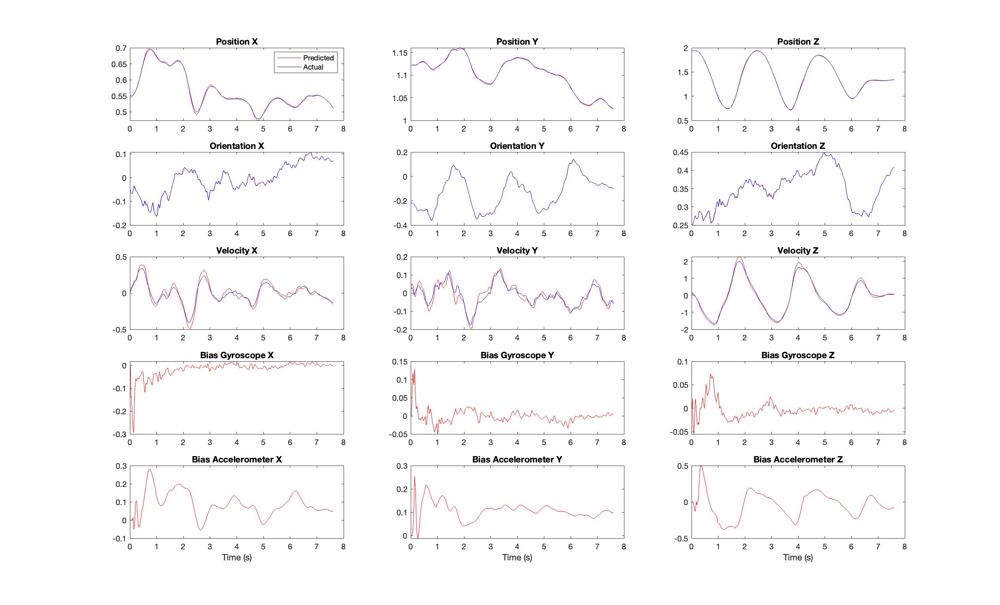

# Project-1-EKF
Implementation of Extended Kalman Filter for quadrotor state estimation by fusing IMU and Vicon data

## Part 1
Perfomed Extended Kalman Filter using measurement in the form of pose(position and orientation) from VICON.

### Results

 
