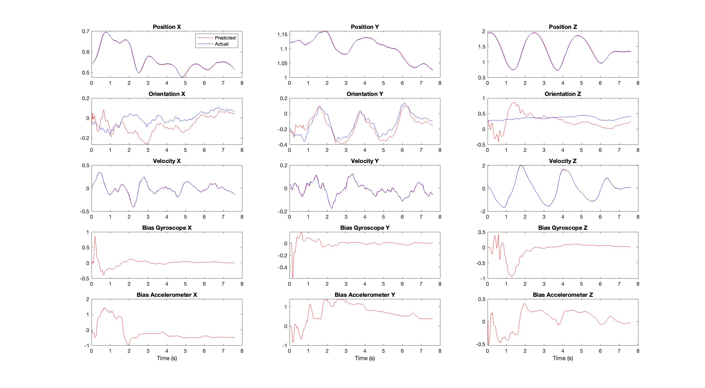

# Project-1-EKF
Implementation of Extended Kalman Filter for quadrotor state estimation by fusing IMU and Vicon data

## Setup
The dataset required for this project is stored in the [data](data) directory and managed using **Git LFS**.

Clone the repository with Git LFS enabled:

```bash
git lfs install
git clone https://github.com/jagennath-hari/Project-1-EKF.git
```

If you cloned the repo without LFS enabled, run:
```bash
git lfs pull
```

## Part 1
Perfomed Extended Kalman Filter using measurement provided by VICON in the form of pose(position and orientation).

### Results
<p align = 'center'></p> 

## Part 2
Perfomed Extended Kalman Filter using measurement provided by VICON in the form of twist(velocity).

### Results
<p align = 'center'></p> 

## Report
To read a detailed report, click [HERE](assets/Report.pdf).
